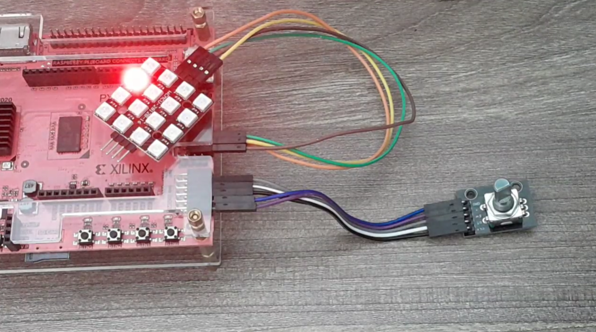
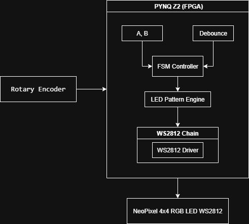

# 🏗️ Tổng Kết Kiến Trúc Hệ Thống RGB Controller — PYNQ-Z2 + Rotary Encoder + WS2812

## 📘 Giới thiệu

Dự án **PYNQ-Z2 RGB Controller** là một mini-project FPGA sử dụng:

- **KY-040 Rotary Encoder** để chọn hiệu ứng,
- **Dải LED WS2812 (Neopixel)** để hiển thị màu sắc và animation,
- **Module giải mã xoay (Rotary Decoder)** + **WS2812 precise timing driver** viết hoàn toàn bằng Verilog.
- [Video Demo](https://youtu.be/tHSJSIIlqwI)

Mục tiêu của dự án là luyện kỹ năng thiết kế mạch số thời gian thực, xử lý tín hiệu từ encoder, debounce, giải mã rotary, và tạo đèn sáng chuẩn cho WS2812.



## ⚙️ Cấu trúc hệ thống

### 🔹 Phần cứng

| Thành phần                | Mô tả                               | Ghi chú                            |
| ------------------------- | ----------------------------------- | ---------------------------------- |
| **PYNQ Z2 FPGA Board**    | Xử lý logic, clock 125 MHz          | Xilinx Zynq-7020                   |
| **KY-040 Rotary Encoder** | Chọn hiệu ứng LED bằng xoay và nhấn | Phase A, B, và nút SW (tuỳ chọn)   |
| **WS2812 LED Strip**      | Hiển thị RGB                        | Cấp nguồn 5V riêng để chạy ổn định |
| **Nguồn ngoài 5V**        | Cấp cho LED strip                   | FPGA chỉ cung cấp tín hiệu dữ liệu |

## 🧩 Sơ đồ khối



## 🌈 Các hiệu ứng RGB hỗ trợ

Hệ thống hỗ trợ nhiều animation khác nhau và xoay encoder để chuyển mode:

| ID  | Pattern               | Mô tả nhanh                          |
| --- | --------------------- | ------------------------------------ |
| 0   | **Static Color**      | Hiển thị một màu cố định             |
| 1   | **Chase**             | LED chạy đuổi từng điểm              |
| 2   | **Alternating Blink** | Nhấp nháy xen kẽ từng nhóm           |
| 3   | **Fade In/Out**       | Hiệu ứng mờ dần và sáng dần liên tục |
| 4   | **Rainbow Rotate**    | Hiệu ứng cầu vồng xoay 360°          |

> Xoay encoder → đổi pattern
> Nhấn SW (nếu bật) → reset về pattern 0

## 🔌 Mapping tín hiệu

### KY-040 Rotary Encoder

| KY-040 Pin | FPGA Pin | Mô tả    |
| ---------- | -------- | -------- |
| +          | 3.3V     | Nguồn    |
| GND        | GND      | Nguồn âm |
| CLK        | `T10`    | Phase A  |
| DT         | `T11`    | Phase B  |
| SW         | `Y14`    | Nút nhấn |

### WS2812 LED Strip

| LED Pin | FPGA Pin | Mô tả            |
| ------- | -------- | ---------------- |
| DIN     | `Y17`    | Tín hiệu dữ liệu |
| 5V      | 5V ext   | Nguồn LED        |
| GND     | GND      | Mass chung       |

> Quan trọng: GND của LED và FPGA phải nối chung.

## 🧩 Cấu trúc mã nguồn

```plaintext
├── src/
│   ├── top.v              // Module top-level kết nối toàn hệ thống
│   ├── rotary_decoder.v   // Giải mã tín hiệu A/B rotary encoder
│   ├── button_manager.v   // Chống dội cho nút SW
│   ├── led_controller.v   // Chọn hiệu ứng dựa vào số bước xoay
│   ├── ws2812_chain.v     // Xử lý giao tiếp, timing, index
│   └── ws2812_driver.v    // Phát tín hiệu chuẩn timming cho WS2812
```

## 🧮 Nguyên lý hoạt động

- Khi xoay **encoder** , module quadrature decoder tạo ra:
  - **step pulse**
  - **direction bit**
- Bộ **pattern selector** tăng/giảm mode.
- **Pattern generator** tạo buffer chứa giá trị RGB của từng LED.
- **WS2812 driver** encode từng bit theo chuẩn timing:
  - Logic 1 → 0.8µs high + 0.45µs low
  - Logic 0 → 0.4µs high + 0.85µs low
- LED strip hiển thị animation tương ứng.

## 👨‍💻 Tác giả

Nguyễn Hữu Hoàng Kiệt —
Sinh viên chương trình Thiết Kế Vi Mạch Bán Dẫn Quốc Tế FPT Jetking.
Hướng đến lĩnh vực thiết kế số, FPGA/ASIC, và firmware cho hệ thống nhúng.
