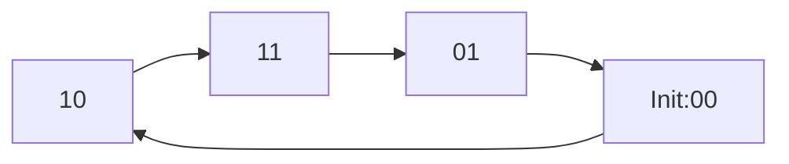
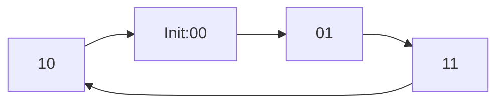

# Bài Tập 360° Rotary Encoder

Mạch Volume xoay Rotary Encoder 360 độ không giới hạn số vòng quay, encoder đưa ra 2 xung vuông 90 độ gọi là 2 phase A và B, xung từ encoder đưa ra có thể dùng để nhận biết chiều quay, tốc độ quay, vị trí, module cung cấp 2 ngõ ra cho 2 phase và 1 ngõ ra dạng nút nhấn.

### 🧩 1. Mục tiêu bài toán

Ta có một **rotary encoder** loại incremental encoder (hay gọi là “quadrature encoder”), có hai ngõ ra:

- A (Channel A)
- B (Channel B)

→ Hai kênh này lệch pha nhau **90° (quarter cycle)**.`<br/>`
→ Khi ta quay núm encoder theo **chiều kim đồng hồ (CW)** hoặc **ngược lại (CCW)**, hai tín hiệu sẽ tạo ra chuỗi logic khác nhau.

👉 Nhiệm vụ:

- Dò **trình tự logic A,B** để xác định hướng quay.
- Có thể đếm số bước (360° chia thành N bước, ví dụ 24 steps/rev).

**Các chân tín hiệu:**

| Symbol | Mean                  |
| ------ | --------------------- |
| +      | Chân cấp nguồn 3~5VDC |
| CLK    | phase A               |
| DT     | phase B               |
| SW     | button                |

**Thông số kỹ thuật:**

- Điện áp sử dụng: 3~5VDC
- Độ phân giải 20 xung/vòng.

### ⚙️ 2. Nguyên lý hoạt động

Giả sử ta có hai tín hiệu dạng sóng như sau:

| Thời gian | A   | B   | Hướng quay |
| --------- | --- | --- | ---------- |
| t0        | 0   | 0   | -          |
| t1        | 1   | 0   | CW         |
| t2        | 1   | 1   | CW         |
| t3        | 0   | 1   | CW         |
| t4        | 0   | 0   | CW         |

Nếu quay **ngược (CCW)** thì thứ tự đảo lại:

```
00 → 01 → 11 → 10 → 00
```

=> Tóm lại:

- **CW (Clockwise)**: 00 → 10 → 11 → 01 → 00
- **CCW (Counter-Clockwise)**: 00 → 01 → 11 → 10 → 00

### 🧠 3. Xây dựng FSM (Finite State Machine)

FSM có thể được xây theo Moore hoặc Mealy.
Ở đây ta dùng Moore FSM vì output chỉ phụ thuộc vào state hiện tại.

#### 🌟 a. Các trạng thái

Ta biểu diễn từng cặp (A,B) là 1 trạng thái:

| Trạng thái | A   | B   |
| ---------- | --- | --- |
| S0         | 0   | 0   |
| S1         | 0   | 1   |
| S2         | 1   | 1   |
| S3         | 1   | 0   |

#### 🌟 b. Chuyển trạng thái

Dựa vào hướng quay:

- **Clockwise (CW)**: S0 → S3 → S2 → S1 → S0
- **Counter-Clockwise (CCW)**: S0 → S1 → S2 → S3 → S0

### 🔄 4. Bảng trạng thái FSM

| State hiện tại | A,B input | Next State | Hướng |
| -------------- | --------- | ---------- | ----- |
| S0 (00)        | 10        | S3         | CW    |
| S3 (10)        | 11        | S2         | CW    |
| S2 (11)        | 01        | S1         | CW    |
| S1 (01)        | 00        | S0         | CW    |
| S0 (00)        | 01        | S1         | CCW   |
| S1 (01)        | 11        | S2         | CCW   |
| S2 (11)        | 10        | S3         | CCW   |
| S3 (10)        | 00        | S0         | CCW   |

### 🧩 5. Đầu ra (Output)

Output có thể là:

- `dir = 1` nếu quay **CW**
- `dir = 0` nếu quay **CCW**
- `count` tăng hoặc giảm tương ứng

### 💻 6. Thiết kế Mermaid FSM

#### Clockwise (CW)



```plaintext
A__________|‾‾‾‾‾‾‾‾‾|________
B_______________|‾‾‾‾‾‾‾‾‾|___
A:    0    1    1    0    0
B:    0    0    1    1    0
```

#### Counter-Clockwise (CCW)



```plaintext
A_______________|‾‾‾‾‾‾‾‾‾|___
B__________|‾‾‾‾‾‾‾‾‾|________
A:    0    0    1    1    0
B:    0    1    1    0    0
```

### 🎯 7. Kết quả mong đợi

| Hành động | Trạng thái đi qua      | Output dir | count |
| --------- | ---------------------- | ---------- | ----- |
| Quay CW   | 00 → 10 → 11 → 01 → 00 | 1          | +1    |
| Quay CCW  | 00 → 01 → 11 → 10 → 00 | 0          | -1    |

### 💡 8. Tóm tắt dễ nhớ

| Nội dung            | Ghi nhớ nhanh                     |
| ------------------- | --------------------------------- |
| FSM có 4 trạng thái | tương ứng 4 tổ hợp (A,B)          |
| Hướng quay CW       | 00→10→11→01→00                    |
| Hướng quay CCW      | 00→01→11→10→00                    |
| FSM output          | `dir` và `count`                  |
| Dùng edge `clk`     | để tránh glitch, ổn định tín hiệu |
