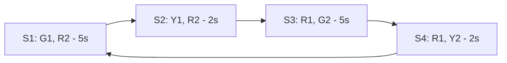

# 🚦 Traffic Light System for Smart Intersection Simulation – PYNQ-Z2

### 📘 Giới thiệu

Dự án **Traffic Light Controller** mô phỏng hoạt động của hai cụm đèn giao thông trên FPGA board PYNQ-Z2.

Mỗi cụm gồm 3 LED: **Đỏ – Vàng – Xanh**. Hai cụm đèn hoạt động luân phiên nhau như tại ngã tư giao lộ.

Hệ thống sử dụng **Finite State Machine (FSM)** điều khiển trạng thái đèn và **bộ chia tần (Clock Divider)** để tạo nhịp 1 Hz (1 giây) mắt người có thể hình thấy.

Mục tiêu: thể hiện rõ chu kỳ chuyển đổi giữa các đèn, mô phỏng thời gian thực của hệ thống đèn giao thông thật.

### 🧠 Nguyên lý hoạt động

| Giai đoạn       | Mạch 1 | Mạch 2 | Thời gian |
| --------------- | ------ | ------ | --------- |
| Pha 1           | Xanh   | Đỏ     | 5 giây    |
| Pha 2           | Vàng   | Đỏ     | 2 giây    |
| Pha 3           | Đỏ     | Xanh   | 5 giây    |
| Pha 4           | Đỏ     | Vàng   | 2 giây    |
| → Lặp lại pha 1 | ...    | ...    | ...       |

Cứ mỗi giây, FSM sẽ tăng bộ đếm `timer`, và khi đạt đủ thời gian cho mỗi pha, hệ thống tự động chuyển sang trạng thái tiếp theo.

### ⚙️ Cấu trúc hệ thống

```textplain
+---------------------------+
|          PYNQ-Z2          |
|                           |
|  +---------------------+  |
|  |     clk_divider     |  |   --> Chia clock 100MHz -> 1Hz
|  +---------+-----------+  |
|            |              |
|         clk_1hz           |
|            |              |
|  +---------v-----------+  |
|  | traffic_light_ctrl  |  |   --> FSM điều khiển 2 cụm đèn
|  +---------+-----------+  |
|            |              |
|     TFL1, TFL2 outputs    |
+---------------------------+
```

### 🧩 Mô tả module

1. `clk_divider.v`
   * Chia tần số clock từ 100 MHz → 1 Hz
   * Dùng bộ đếm count để tạo xung vuông 1 giây
   * Ngõ ra clk_out dùng làm nhịp cho FSM

2. `traffic_light_controller.v`
    * Bộ điều khiển FSM gồm 4 trạng thái:
      * S1_G1_R2: Mạch 1 xanh – Mạch 2 đỏ
      * S2_Y1_R2: Mạch 1 vàng – Mạch 2 đỏ
      * S3_R1_G2: Mạch 1 đỏ – Mạch 2 xanh
      * S4_R1_Y2: Mạch 1 đỏ – Mạch 2 vàng
    * Bộ đếm timer xác định thời gian từng pha.

3. `top_traffic_light.v`
   * Module tổng hợp, kết nối clk_divider và traffic_light_controller
   * Map các LED thực tế của PYNQ-Z2.

### 🧮 Sơ đồ trạng thái FSM (Mermaid)



#### 🔧 Pin Mapping (PYNQ-Z2)

| LED trên board | Vai trò | Ghi chú        |
| -------------- | ------- | -------------- |
| Y19            | G1      | Đèn xanh cụm 1 |
| Y16            | Y1      | Đèn vàng cụm 1 |
| Y17            | R1      | Đèn đỏ cụm 1   |
| Y14            | G2      | Đèn xanh cụm 2 |
| T11            | Y2      | Đèn vàng cụm 2 |
| T10            | R2      | Đèn đỏ cụm 2   |

### 🎯 Kết quả mong đợi

* Hai cụm LED sáng luân phiên:
* Khi **M1 xanh → M2 đỏ**
* Sau 5 giây, **M1 vàng** trong 2 giây
* Sau đó **M2 xanh – M1 đỏ**, và tiếp tục lặp lại.
* Chu kỳ đầy đủ kéo dài **14 giây thực tế**.
